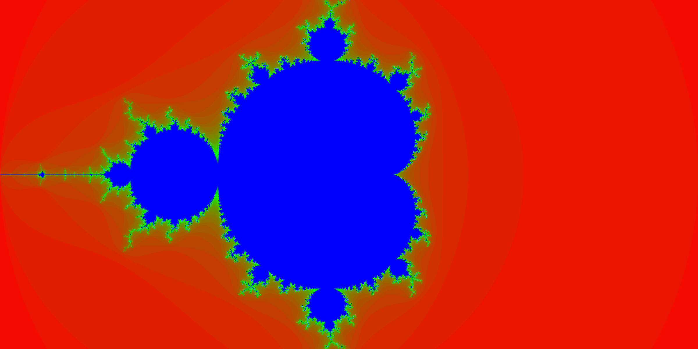

# Mandelbrot set visualizer

Threaded Mandelbrot set graph generator and TUI fractal explorer.

## Usage:
`python3/py3 main.py` to generate a visualization of the set with resolution given on `PARAMS.py`

or

`python3/py3 tui.py` for an interactive terminal based fractal!

## To do:
- [x] TUI visualizer
- [ ] ~~Finish up pooled TUI~~ Figure out wtf is even going with tuiPooled
